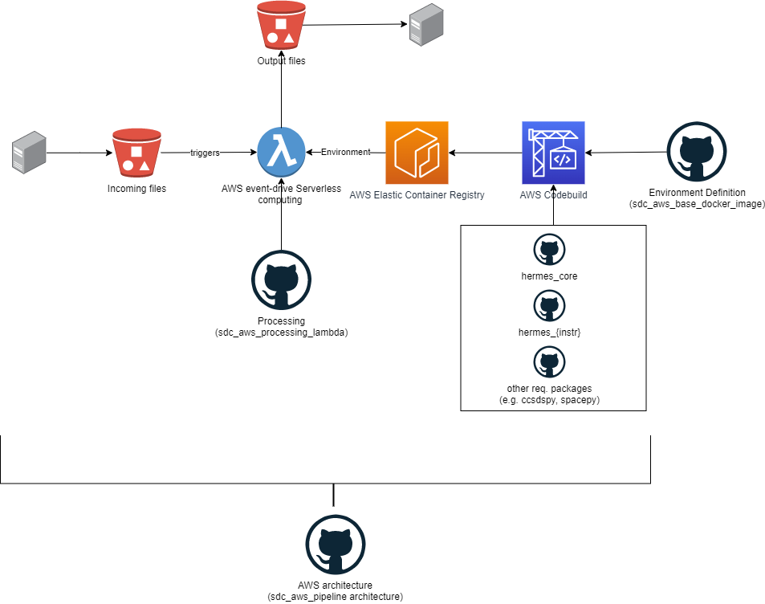
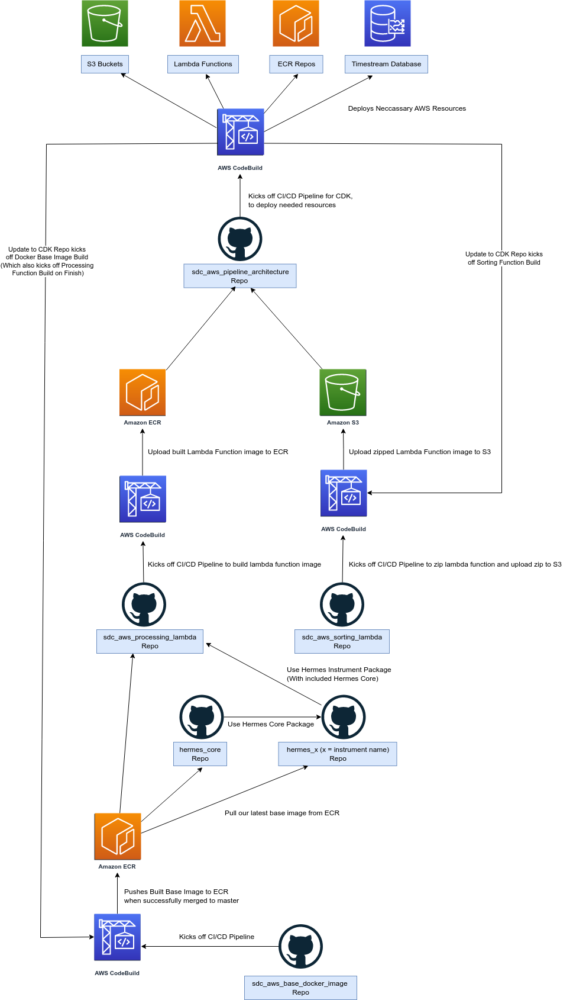

.. _pipeline-diagrams:

Pipeline Diagrams
==================

Diagram of Full Pipeline (SDC Pipeline only)
---------------------------------------------
This is a diagram of the full pipeline, showing the different steps on how the data flow throughs it from the external server. It also show the different support systems to the pipeline:

.. Note::
   The diagram shows the only the **Processing** Lambda function but the **Sorting** Lambda function is also part of the pipeline and essentially works the same way. It is triggered by the same S3 event and it is also triggered by the same CloudWatch event, but instead of processing it sorts the instrument file to their respective instrument buckets.

Diagram of CI/CD Pipeline
-------------------------
This is a diagram of how we've set up our CI/CD pipeline that we've set up to make updates to the pipeline easier and more efficient. It also shows the different steps that the pipeline goes through:

.. Note::
   The diagram shows the only CodeBuild processes of the pipeline which gets triggered when there is a change to main of each Repo. We also have GitHub actions set-up to do linting and testing on Pull Requests as well.
