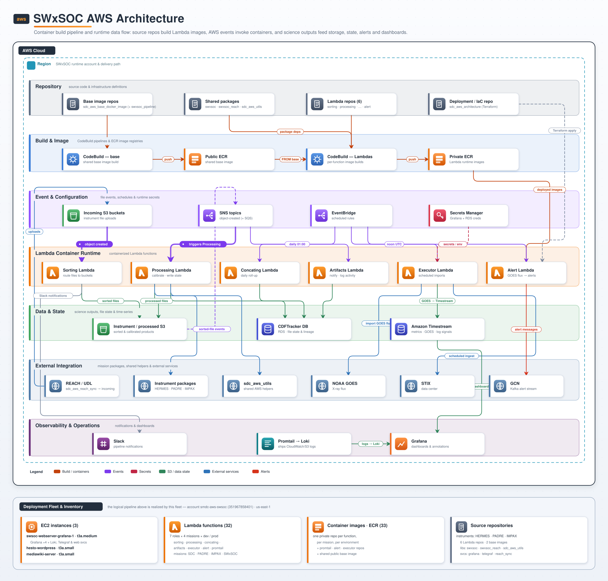

.. _aws-architecture:

AWS Architecture
================

This page gives a single, lane-based view of the SWxSOC pipeline as it runs on
AWS: how source repositories are built into Lambda container images, how AWS
events invoke those functions, and how science outputs flow into storage, state,
alerts, and dashboards.

   SWxSOC AWS architecture. Lanes read top to bottom: source repositories build
   Lambda container images, AWS events and schedules invoke the runtime
   functions, and science outputs feed storage, state, external services,
   alerts, and dashboards.

Runtime Flow
------------

**Build and deploy.** A base image repository is built by CodeBuild and
published to a public ECR repository as the shared base image. Each Lambda
repository (sorting, processing, concating, artifacts, executor, alert),
together with shared packages such as ``swxsoc``, ``CDFTracker``, and
``sdc_aws_utils``, is built ``FROM`` that base image and pushed to a private
ECR repository as a per-function runtime image. This repository
(``sdc_aws_architecture``) is the deployment/IaC root: its CodeBuild project runs
``terraform apply`` for the selected mission, resolves the latest image tags from
ECR, and points each Lambda at its deployed image.

**Ingest and sorting.** External providers such as REACH / UDL upload raw
instrument files into the incoming S3 buckets. An ``s3:ObjectCreated`` event
invokes the **Sorting Lambda**, which routes each file into its per-instrument
bucket (and also runs on a 12-hour sweep). Sorting posts status to Slack.

**Event-driven processing.** Object-created events on the instrument buckets
publish to per-instrument **SNS topics** (with companion SQS queues), which fan
out to the **Processing** and **Artifacts** Lambdas. Processing calibrates the
file using the instrument packages and ``sdc_aws_utils``, writes calibrated
products back to S3, records file state and lineage in the **CDFTracker** RDS
(PostgreSQL) database, and emits metrics to **Amazon Timestream**. Artifacts
records artifact metadata in CDFTracker and posts notifications to Slack.

**Scheduled work.** EventBridge rules drive the time-based functions: the
**Concating Lambda** rolls up files daily at 01:00 UTC (writing to CDFTracker),
and the **Executor Lambda** runs at noon UTC to import NOAA GOES X-ray flux into
Timestream and create GOES annotations in Grafana (it also generates a periodic
CLOC report). The **Alert Lambda** is scheduled to watch GOES flux and emit alert
messages to the GCN Kafka stream. All runtime functions read configuration and
credentials (Grafana and RDS) from AWS Secrets Manager.

**Observability.** The Sorting and Artifacts Lambdas post pipeline
notifications to Slack. A **Promtail** Lambda ships CloudWatch and S3 logs to
Loki, a **Telegraf** agent on the Grafana host feeds metrics to Timestream, and
Grafana visualizes the metric, log, and GOES signals.

**Deployment footprint.** The bottom section of the diagram summarizes what the
logical pipeline actually runs as in the account: three EC2 instances —
including the Grafana host (an EC2 instance that runs the Grafana containers
plus Loki, Telegraf, and web services) — alongside 32 Lambda
functions (the seven roles deployed per mission and per environment) and 33
private ECR repositories (one image per function/mission/environment) plus the
shared public base image. On the source side the system is built from
per-instrument science packages for the HERMES, PADRE, and IMPAX missions; the
six Lambda function repositories; the ``swxsoc``, ``swxsoc_reach``, and
``sdc_aws_utils`` libraries; and supporting service repositories
(``sdc_aws_grafana``, ``sdc_aws_telegraf``, ``sdc_aws_reach_sync``).

.. note::

   The Alert Lambda, the GCN Kafka stream, and the STIX data center are part of
   the wider SWxSOC system and are defined outside this repository; they are
   shown here for end-to-end context. Everything else on the diagram is
   provisioned by the Terraform in this repo.

Updating the diagram
--------------------

The diagram is generated from a single, declarative source so the whole team can
keep it current. Edit the ``LANES``, ``NODES``, and ``EDGES`` lists (or the
palette) in ``docs/_static/diagrams/generate_architecture_svg.py`` and
regenerate the SVG:

.. code-block:: bash

    python3 docs/_static/diagrams/generate_architecture_svg.py

The script uses only the Python standard library and writes
``swxsoc_aws_architecture.svg`` next to itself. Commit both the script and the
regenerated SVG. The output is a self-contained SVG (no external fonts, icons,
or Sphinx extensions required) that renders identically in the docs, in a
browser, and in presentation tools.
